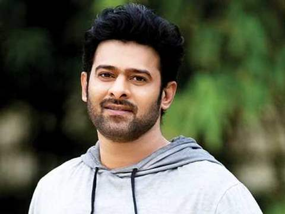

# lohitha vodnala
One of my favorite movies is **Bahubali**. The movie is a brilliant mix of action, drama, and intense storytelling. The Prabhas performance as the King was nothing short of legendary, making it one of the most memorable roles in cinema history.

---
## Alternate Casting Choices
While the original actor delivered a stellar performance, here are some other talented actors who could have also played the main role. This table lists my top choices, along with the reasons for my picks and their respective ages.
| Actor Name         | Reason                                            | Age |
|--------------------|-------------------------------------------------- |-----|
| Pawan kalyan       | His versatility and ability to portray intensity. | 53  |
| Anushka shetty     | Her powerful screen presence and emotional depth. | 43  |
| surya              | His charisma and ability to reinvent characters.  | 49  |
| samantha           | Her dynamic range and ability to transform roles. | 37  |
